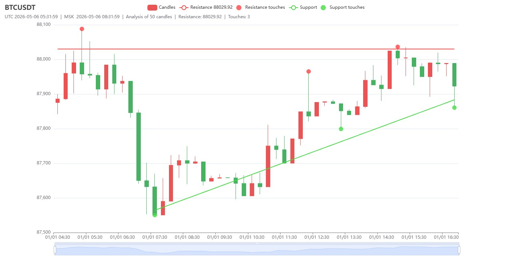

# Triangle Detector

CLI tool that loads Binance spot candlesticks, scans sliding windows for **ascending triangle** patterns (horizontal resistance + rising support), and saves **charts** (HTML -> PNG via headless Chrome), **summary stats**, and **per-step debug text** traces under `tmp/`.



**Batch mode** walks historical ranges per symbol (from `.env` or `-symbol`). **Realtime mode** (`-realtime`) polls all USDT pairs on each candle close, with optional screenshots and deduplicated alerts.

## Structure

```
cmd/triangled/          — CLI entry (batch + realtime)
internal/
  domain/               — Candle
  detect/               — public API facade (DetectAscendingTriangle, options, counters)
  detect/spec/          — Params, RejectReason, RejectCounter
  detect/engine/        — detection pipeline, steps, ATR, swings, resistance, logs
  render/               — ChartRenderer interface
  render/echarts/       — go-echarts implementation
  app/                  — render orchestration
  artifact/             — output paths (PNG, step txt 1–11)
  screenshot/           — chromedp → PNG
  marketdata/binance/   — REST klines
  config/               — .env, AppConfig
pkg/triangle/           — stable re-exports for library use
```

## Build

```sh
go build ./cmd/triangled/
# or:
make build
```

## Usage

Copy `.env.example` to `.env` and set `DATA_DIR` and `SYMBOLS`:

```env
DATA_DIR=tmp
SYMBOLS=BTCUSDT,ETHUSDT,BNBUSDT
```

**Batch scan:**

```sh
./triangled
```

**Realtime monitor:**

```sh
./triangled -realtime
```

## Tests

```sh
make test
# or:
go test ./internal/...
```
